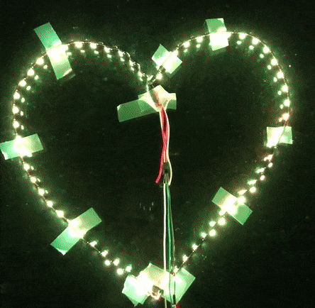
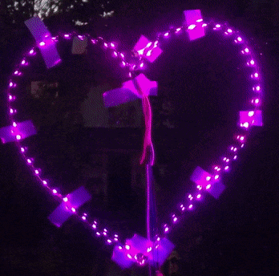
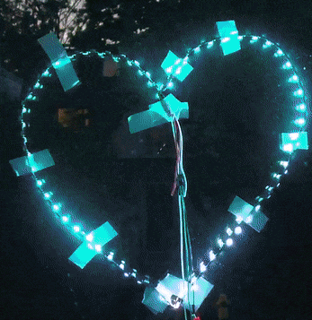
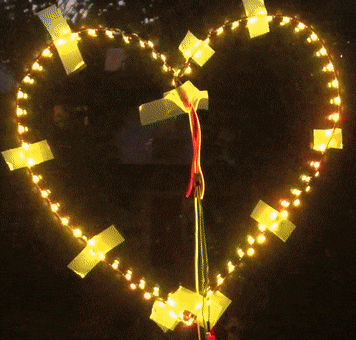
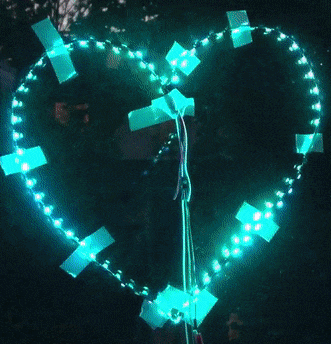
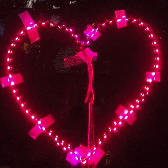
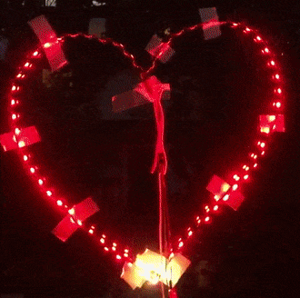

# LEDGeometry
Light effects using Arduino and WS2812B addressable LED strips.

## Demo
This demo showcases 7 light effects for a heart-shaped WS2812B LED strip controlled by an Arduino Nano. For more information, see `examples/heart/heart.ino`.

<details>

### 1. Mono-color


### 2. Signal transmission


### 3. Ripple


### 4. Pulse


### 5. Tide


### 6. Spiral


### 7. Flame


</details>

## Instructions
To reproduce the above effects, follow these steps.

1. **Materials**
   - One [Arduino Nano](https://www.arduino.cc/en/pmwiki.php?n=Main/ArduinoBoardNano)
   - One [WS2812B LED strip](https://www.amazon.ca/gp/product/B07RBVKLPX)
   - One [Mini USB cable](https://www.amazon.ca/gp/product/B00016W6NC)
   - [Optional] [Jumper wires](https://www.amazon.ca/gp/product/B01ERPEMAC/)
   - [Optional] [Clip cables](https://www.amazon.ca/gp/product/B06XCJ5YLY)
   - [Optional] Clear tape

2. **Hook up**
   1. Fold the LED strip to form a two-sided light.
   2. Shape it (e.g. heart) and attach it to a window.
   3. Connect the LED strip data pin to pin 7 on the Arduino Nano, and power/ground lines to 5 V and GND.

3. **Light up**
   1. Install the [Arduino IDE](https://www.arduino.cc/en/software).
   2. Open `examples/heart/heart.ino` in the Arduino IDE.
   3. Copy `src/` to `<Arduino Libraries directory>/LEDGeometry`.
   4. Upload the sketch to your Arduino Nano.

4. **Calibrate** (to match the effect to your physical LED layout)
   1. Turn the LEDs on and take a photo.
   2. Run `scripts/locate_lights.py` to extract each LED's position from the photo and generate coordinate arrays.
   3. Copy the generated coordinate arrays into your `.ino` sketch.
   4. Upload the updated sketch to your Arduino Nano.

## Debug mode (desktop simulation)
The library can be compiled and run on a desktop machine to preview effects without hardware.

**Requirements:** a C++11 compiler and the `lib8tion` library in a sibling directory (`../lib8tion`).

```bash
cd src
bash setup.sh   # compiles test.cpp with -DDEBUG into a.exe
./a.exe         # prints one line per frame to stdout
```

Each line has the format:
```
Frame N (r,g,b) (r,g,b) ... (r,g,b)
```
where `N` is the zero-based frame index within the current effect, and each `(r,g,b)` is the RGB color of one LED after folding and blackout are applied.

To use debug mode in your own file, compile with `-DDEBUG` and include the same headers as `src/test.cpp`. No hardware or Arduino IDE is required.
