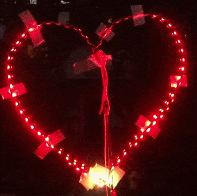

# LEDGeometry
Light Effects using Arduino

## Demo
This demo show case 7 light effects for a heart-shaped WS2812b LED light controlled by Arduino nano. For more information, please see `example/heart/heart.ino`

### 1. Mono-color

### 2. Signal transmission

### 3. Ripple

### 4. Pulse

### 5. Tide

### 6. Spiral

### 7. Flame

## Instructions
To reproduce the above effect, please follow these steps.

1. Materials
     * One [Arduino Nano](https://www.arduino.cc/en/pmwiki.php?n=Main/ArduinoBoardNano)
     * One [WS2812b light](https://www.amazon.ca/gp/product/B07RBVKLPX)
     * One [Mini USB cable](https://www.amazon.ca/gp/product/B00016W6NC) for charging
     * [Optional] some [jumper wires](https://www.amazon.ca/gp/product/B01ERPEMAC/)
     * [Optional] some [clip cables](https://www.amazon.ca/gp/product/B06XCJ5YLY)
     * [Optional] clear tapes
2. Hook up
   1. Fold the LED light to form a two-sided light
   2. Make the LED light into a heart shape and attach it to a window
   3. [TODO] add wiring instructions
3. Light up
   1. Install the [Arduino IDE](https://www.arduino.cc/en/software)
   2. Open `example\heart\heart.ino` using Arduino IDE
   3. Copy `src/` to `<Arduino Libraries directory>/LEDGeometry`
   4. Upload the code to your Arduino board
4. Calibrate
   1. Take a photo while the lights are on.
   2. Use `scripts/locate_light.py` to get the locations of each light. [TODO] add details
   3. Copy-paste the coordinates of the lights into `examples\heart\heart.ino`
   4. Upload the code again to your Arduino board
